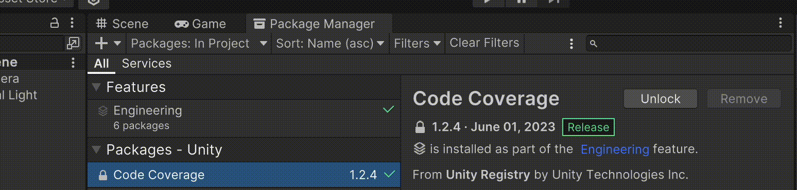
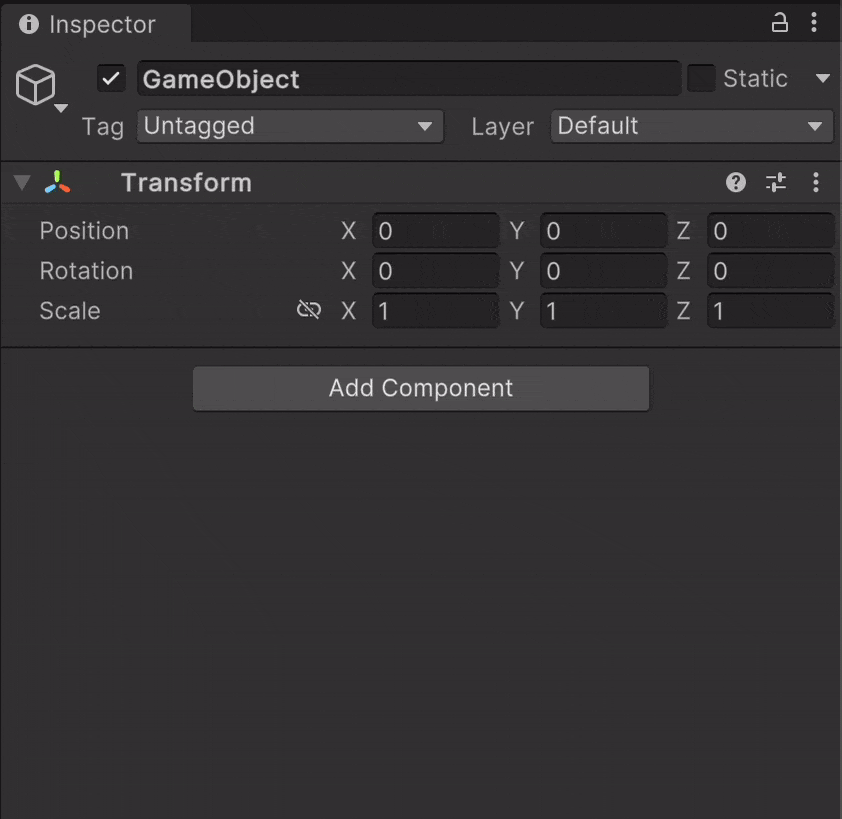
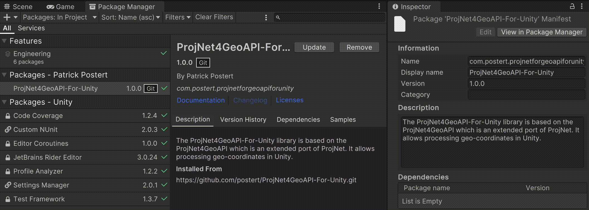
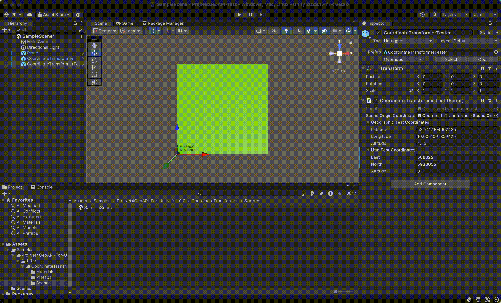

# ProjNet4GeoAPI-For-Unity

## Synopsis

This library allows processing geo-coordinates in Unity. It is based on [NetTopologySuite](https://github.com/NetTopologySuite/)'s [ProjNet4GeoAPI](https://github.com/NetTopologySuite/ProjNet4GeoAPI) which is an extended port of [ProjNet](http://projnet.codeplex.com). 

## Motivation

As Unity relies on float-based coordinate reference system. Thus, the immediate processing of geo-coordinates (double) in Unity induces a significant loss of precision. To address this issue, this library provides methods for ad-hoc coordinate transformation. 


## Installation

To add this library to your project, you can use the Package Manager:

Go to the package manager and click on “Install package from git URL” and add this URL:  

```
https://github.com/postert/ProjNet4GeoAPI-For-Unity.git
```



## Configuration

For the transformation into Unity coordinates, the library requires the specification of a projected reference point, which corresponds to the origin of Unity's coordinate system and the point's WGS84/UTM coordinate reference system (CRS). Geo-coordinates are placed relative to this point in Unity's *Scene*. The point and CRS must be specified in the `CoordinateTransformer` script.

#### Required Parameters and examples

1. WGS84/UTM coordinate reference system for your location (e.g. via [mangomap.com](https://mangomap.com/robertyoung/maps/69585/what-utm-zone-am-i-in-#))
	1. Estimate the ***UTM Zone*** (e.g. *32* for Hamburg in Germany)
	2. Estimate the ***Hemisphere*** whether your location is in the *Northern Hemisphere* or *Southern Hemisphere* (e.g. *Northern* Hemisphere for Hamburg)
2. UTM coordinates of the projected reference point (e.g. via [coordinates-converter.com](https://coordinates-converter.com/en/decimal/53.541675,10.005033?karte=OpenStreetMap&zoom=18))
	1. Estimate the ***East*** value of the projected reference point (e.g. *566600 E* for the Lohsepark in Hamburg)
	2. Estimate the ***North*** value of the projected reference point (e.g. *5933000 N* for the Lohsepark in Hamburg)
	3. Provide the ***Altitude*** value of the projected reference point (e.g. 0 in the German altitude reference system [DHHN2016](https://de.wikipedia.org/wiki/Deutsches_Haupthöhennetz))

```geojson
{
  "type": "FeatureCollection",
  "features": [
    {
      "type": "Feature",
      "id": 1,
      "properties": {
        "ID": 0
      },
      "geometry": {
        "type": "Polygon",
        "coordinates": [
          [
              [10.0050334941202,53.5416751454004],
              [10.0065422978258,53.541662455265],
              [10.0065636189796,53.5425611772512],
              [10.0050547833268,53.5425738678005],
              [10.0050334941202,53.5416751454004]
          ]
        ]
      }
    }
  ]
}
```

#### Apply Parameters

To apply the parameters, add **one** `CoordinateTransformer` script to the Unity *Scene* and provide the previously described reference point and its WGS84/UTM coordinate reference system accordingly. (The script can be added to an arbitrary GameObject (GO). It is not necessary to reset the GO's transform to the default values.) 



### Example of Coordinate Transformation Execution

Coordinate transformations can be executed via the `CoordinateTransformer`, which is defined in the `GeocoordinateTransformer` namespace. `CoordinateTransformer` provides the following six methods for immediate coordinate conversion.

```C#
// 1. Import the library's namespace
using GeocoordinateTransformer;

// ...

// 2. Define example coordinates to transform
private GeographicCoordinates geographicTestCoordinates = new(latitude: 53.5417104602435, longitude: 10.0051097859429, altitude: 4.25);
private UTMCoordinates utmTestCoordinates = new(east: 566605, north: 5933004, altitude: 3);
private Vector3 unityTestCoordinates = new(x: 1, y: 4, z: 5);

// ...

// 3. Find CoordinateTransformer with associated parameters in the Unity Scene
CoordinateTransformer coordinateTransformer = GameObject.FindAnyObjectByType<CoordinateTransformer>();

// 4. Execute coordinate transformation

// 4.1 GeographicCoordinates ⇄ Vector3 (Unity)
Vector3 unityCoordinates1 = CoordinateTransformer.GetUnityCoordinates(geographicTestCoordinates);
GeographicCoordinates geographicCoordinates1 = CoordinateTransformer.GetGeographicCoordinates(unityCoordinates);

// 4.2 UTMCoordinates ⇄ Vector3 (Unity)
Vector3 unityCoordinates2 = CoordinateTransformer.GetUnityCoordinates(utmTestCoordinates);
UTMCoordinates utmCoordinates2 = CoordinateTransformer.GetUTMCoordinates(unityCoordinates);

// 4.3 GeographicCoordinates ⇄ UTMCoordinates
GeographicCoordinates geographicCoordinates3 = CoordinateTransformer.GetGeographicCoordinates(utmTestCoordinates);
UTMCoordinates utmCoordinates3 = CoordinateTransformer.GetUTMCoordinates(geographicTestCoordinates);
```

For a more comprehensive overview, have a look at the [documentation](documentation.pdf) and use the [Sample Scene](#sample-scene-included-in-library) as a starting point.

# Sample Scene (included in Library)

A sample Unity *Scene* is included in the library and can be added to the *Assets* folder via an import in Unity's Package Manager:



*SampleScene* contains a *Plane*, a *CoordinateTransformer*, and a *CoordinateTransformerTest* GameObject. The *Plane* visualizes the geo-coordinates associated with Unity's coordinate system's origin. The *CoordinateTransformer* GO contains the `CoordinateTransformer` component, described in the [Apply Parameters](#apply-parameters) section. The *CoordinateTransformerTest* GO provides test functionality to either place the latter GO according to the provided coordinates or to print the GO's current location as geo-coordinates. 



## Limitations

The current implementation does not support [floating origins](https://gamedev.stackexchange.com/questions/110349/is-a-custom-coordinate-system-possible-in-unity/110369#110369). Thus, the float-induced limited spatial extent of Unity's scene is not immediately addressed in this library. However, the library can still serve a foundation of these approaches, as the `CoordinateTransformer` can be updated and the *Scene*'s content be moved within the *Scene* accordingly.
